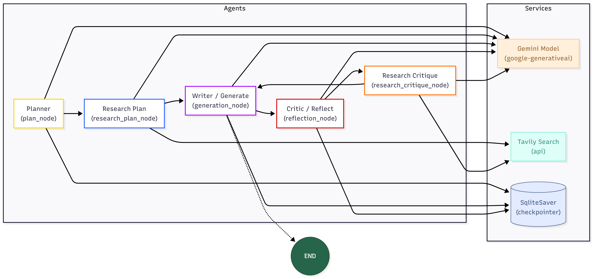

# 🧠 Multi-Agent AI Report System with LangGraph

This project is a **multi-agent automated report generator** built using **LangGraph**, **Groq API**, **Tavily Search**, and **Gradio** for the interface.  
Each agent in the system works autonomously yet collaboratively — analyzing data, researching, writing reports, and reflecting on the results before delivering the final report.

---

## 🚀 Project Overview

The system simulates a coordinated AI workflow where multiple intelligent agents perform specific tasks:
- Fetch and verify information from reliable sources.
- Generate summaries and structured reports.
- Reflect and revise content for accuracy.
- Provide citations and clickable URLs for transparency.
- Politely decline off-topic or conversational questions.

---

## ⚙️ Tech Stack

| Component | Description |
|------------|-------------|
| **LangGraph** | Framework for defining agent graphs and state-based workflows |
| **Groq API** | High-speed LLM API for processing and reasoning |
| **Tavily API** | Real-time web search and information retrieval |
| **Gradio** | Web UI for interacting with the system |
| **SQLite** | Checkpointing for conversation memory persistence |

---

## 🤖 Agent Purposes

Each agent plays a distinct role in the workflow, ensuring smooth data exchange and logical sequencing.

| Agent | Purpose |
|--------|----------|
| **Reader Agent** | Reads and parses user input (text, job posting, query) |
| **Analyzer Agent** | Extracts intent, key entities, and important details |
| **Research Agent** | Searches verified online sources using Tavily |
| **Writer Agent** | Generates drafts and structured outputs in JSON or text |
| **Reflector Agent** | Evaluates and refines the content for quality and accuracy |
| **Final Agent** | Compiles and formats the final report with sources |

---

## 🧩 Agent Functionalities

Here’s what each agent specifically does:

### 🕮 Reader Agent
- Accepts both JSON and plain text input automatically.
- Cleans and normalizes text for further processing.
- Detects whether the next step should be analytical or generative.

### 🧠 Analyzer Agent
- Identifies user intent and task type.
- Extracts essential parameters like keywords, goals, or constraints.
- Determines if the query requires research or internal generation.

### 🌐 Research Agent
- Fetches information from the web using the **Tavily Search API**.
- Returns results in structured JSON with **clickable URLs** as sources.
- Filters out unreliable or unverified content.

### ✍️ Writer Agent
- Uses **Groq API** to generate structured drafts or summaries.
- Automatically outputs either JSON (for agents) or plain text (for humans).
- Adds citations and references from the Research Agent.

### 🪞 Reflector Agent
- Reviews previous outputs for factual accuracy and clarity.
- Ensures the writing aligns with user goals and readability standards.
- Suggests improvements before sending to the Final Agent.

### 📄 Final Agent
- Combines all outputs into a formatted final report.
- Ensures all sources are properly linked.
- Refuses general/greeting questions politely (e.g., “I’m focused on report generation tasks only.”).

---

## 🖼️ System Architecture

The diagram below illustrates the data flow and interactions between agents.



---

## 🧩 Key Features

- 💡 Autonomous sequential agent execution
- 🔄 JSON-to-text adaptive output
- 🌐 Verified research with clickable sources
- 🚫 Graceful refusal for non-report queries
- 🪶 Built-in reflection and quality assessment
- 💾 Persistent state via SQLite checkpoints

---

## 🧰 Setup Instructions

1. **Clone the repository**
   ```bash
   git clone https://github.com/your-username/Multi-Agent-AI-Report-System-with-LangGraph.git
   cd Multi-Agent-AI-Report-System-with-LangGraph


2. **Install dependencies**

   ```bash
   pip install -r requirements.txt
   ```

3. **Create `.env` file**

   ```bash
   GROQ_API_KEY=your_groq_api_key
   TAVILY_API_KEY=your_tavily_api_key
   ```

4. **Run the app**

   ```bash
   python app.py
   ```

5. **Access the interface**

   ```
   http://127.0.0.1:7860
   ```

---

## 🧭 Example Query

**Input:**

> “Generate a short market analysis for the AI automation tools industry in 2025.”

**Output:**

* A concise market overview.
* Supporting references with clickable source URLs.
* JSON output if the next agent is the consumer.

---

## 🧑‍💻 Author

Developed by **Etheal Sintayehu**
For contributions or collaborations: *coming soon!*

---

## 🪪 License

This project is licensed under the **MIT License**.

```


## 📝 Advanced Features

* **Async streaming:** Optional `astream()` for real-time updates
* **Dynamic research:** Agents generate queries based on gaps in drafts
* **Iterative refinement:** Reflection + research critique loop ensures report quality
* **Memory / checkpointing:** Using `SqliteSaver` to resume work mid-process
* **Logging:** Each agent logs progress for easy debugging

---

## 🔧 Developer Notes

* You can **swap models** (OpenAI ↔ Gemini) without changing agent logic
* Customize **prompts** for different domains: finance, tech, policy, etc.
* Extend `Queries` model for structured search filters (date, source, type)
* Supports multi-threading for parallel research queries
* Agents are modular: add, remove, or replace nodes for custom workflows


## 📚 References

* [LangGraph Docs](https://www.langchain.com/langgraph)
* [LangChain Core](https://python.langchain.com/api_reference/core/index.html)
* [Tavily API](https://docs.tavily.com/)
* [Google Gemini API](https://ai.google.dev/gemini-api/docs)


⭐ Support & Feedback

If you like what we are building here and want to support the project, the easiest way is to hit the ⭐ Star button on GitHub.

Your support helps us improve this multi-agent AI system and keep building useful tools for research and report generation.

Thank you! 🙏

[⭐ Star this project on GitHub]( https://github.com/Etheal9/Multi-Agent-AI-Report-System-with-LangGraph?tab=readme-ov-file AI Report System with LangGraph) – Thank you for your support!

