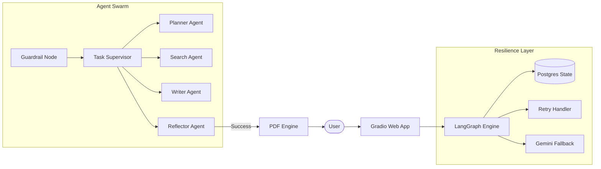

# 🧠 Multi-Agent AI Report System with LangGraph

**A resilient, enterprise-grade automated research and report generation platform designed to transform complex inquiries into verified, expert-level strategy reports.**

---

## ## Overview

The **Multi-Agent AI Report System** is an orchestration of specialized AI agents working in a collaborative, self-correcting swarm. Built on the **LangGraph** framework, it solves the problem of "shallow" AI responses by enforcing a strict cycle of planning, deep specialized research (via Tavily), multi-draft synthesis, and adversarial critique.

Historically, LLMs struggle with factual recency and structural consistency in long-form reports. This project addresses those gaps by:
1.  **Orchestrating Source Verification**: Every claim is backed by real-time web searches.
2.  **Enforcing Quality Control**: A dedicated 'Reflector' agent audits drafts and triggers revisions if quality standards aren't met.
3.  **Guaranteeing Production Resilience**: Using `tenacity` for self-healing API calls and a dual-provider (Groq/Gemini) fallback strategy.

---

## ## Target Audience

*   **Intelligence Analysts**: Automating the "first draft" of market and technical briefings.
*   **AI Developers**: Exploring advanced **LangGraph** patterns and multi-agent state management.
*   **Research Teams**: Scaling high-volume information gathering with consistent citations.
*   **Strategy Consultants**: Rapidly synthesizing industry trends into professional PDF deliverables.

---

## ## Methodology

The system employs a **Cyclic State Machine** methodology. Unlike linear chains, this architecture allows agents to "loop back" if the results are unsatisfactory.

### The Self-Correction Loop
1.  **Planning**: An Expert Planner creates a structural schema for the report.
2.  **Research**: A Robust Researcher executes parallel queries to find evidence for each schema section.
3.  **Writing**: A Synthesizer merges evidence into a coherent Markdown document.
4.  **Critique**: The Reflector evaluates the writer's work. If gaps exist, it sends the state back to the Researcher with specific "missing info" instructions.

---

## ## High-Level System Design & Architecture

### System Flow Diagram

```mermaid
graph LR
    User([User]) --> UI[Gradio Web App]
    UI --> App[LangGraph Engine]
    
    subgraph "Resilience Layer"
        App --> C[(Postgres State)]
        App --> R[Retry Handler]
        App --> F[Gemini Fallback]
    end
    
    subgraph "Agent Swarm"
        Guard[Guardrail Node] --> Supervisor[Task Supervisor]
        Supervisor --> Planner[Planner Agent]
        Supervisor --> Searcher[Search Agent]
        Supervisor --> Writer[Writer Agent]
        Supervisor --> Reflector[Reflector Agent]
    end
    
    Reflector -- Success --> Export[PDF Engine]
    Export --> User
```

---

## ## Individual Agent Details

| Agent Role | Logic Description | Skill/Tool |
| :--- | :--- | :--- |
| **Guardian** | Validates safety and length requirements. | `guardrail_node` |
| **Strategist** | Hypothetically maps the user request to a detailed plan. | `expert_planner_skill` |
| **Searcher** | Generates search intent and scrapes sources. | `robust_search_skill` |
| **Synthesizer**| Merges research intoCited Markdown. | `report_writer_skill` |
| **Evaluator** | Critiques for tone, accuracy, and flow. | `critique_skill` |

---

## ## Prerequisites

*   **OS Compatibility**: Windows 10/11, Linux, macOS.
*   **Language**: Python 3.12 or higher.
*   **Hardware**: Standard CPU (LLM processing is offloaded to Groq/Gemini APIs).
*   **Required Keys**: Groq API Key, Tavily API Key.

---

## ## Installation

1.  **Clone the repository**:
    ```bash
    git clone https://github.com/Etheal9/Multi-Agent-AI-Report-System-with-LangGraph.git
    cd Multi-Agent-AI-Report-System-with-LangGraph
    ```
2.  **Create a Virtual Environment**:
    ```bash
    python -m venv venv
    source venv/bin/activate  # On Windows: .\venv\Scripts\activate
    ```
3.  **Install Core Dependencies**:
    ```bash
    pip install -r requirements.txt
    ```

---

## ## Environment Setup

1.  Copy the sample environment file:
    ```bash
    cp .env.sample .env
    ```
2.  Configure your credentials in `.env`:
    *   `GROQ_API_KEY`: High-speed Llama-3/Gemma inference.
    *   `TAVILY_API_KEY`: Verified web search retrieval.
    *   `GEMINI_API_KEY`: (Optional) Secondary failover LLM.
    *   `DATABASE_URL`: (Optional) Connection string for persistency via PostgreSQL.

---

## ## Usage

### Launching the Gradio Web interface
```bash
python chat_interface.py
```
**Example Task Workflow:**
1.  **Input**: "Analyze the impact of Quantum Computing on Financial Cryptography by 2030."
2.  **Observation**: The terminal will show planning logs -> research queries -> draft generations.
3.  **Output**: A fully cited report appears in the Chatbot window.
4.  **Export**: Click "Export to PDF" to generate a professional document.

---

## ## Data Requirements

*   **Inputs**: Plain text queries or JSON-formatted research requests.
*   **Internal State**: The system manages a `TypedDict` state containing `messages`, `gathered_content`, and `critique_notes`.
*   **Outputs**: Markdown reports, source-tracking logs, and final PDF files.

---

## ## Configuration Options

The system is highly tunable via `app.py` and `.env`:
*   **`recursion_limit`**: Default `25`. Prevents infinite loops in complex research tasks.
*   **`max_tokens`**: Configurable in `groq_client.py` for each node.
*   **Persistence**: Automatically falls back from PostgreSQL to SQLite or Local Memory depending on availability.

---

## ## Testing & Quality Assurance

The system uses **Test-Driven Development (TDD)** to maintain an **80% Minimum Coverage Target**.

### How to Run Tests
```bash
# Run the full suite
pytest -v test_app.py test_db_manager.py test_failover.py test_guardrails.py test_tools.py

# Check Coverage
pytest --cov=. --cov-report=term-missing
```

---

## ## Performance

*   **Latency**: Groq LPU technology ensures inference times of <1s for most agent thoughts.
*   **Throughput**: Asynchronous searching allows 2-4 search queries to be executed in parallel per research cycle.
*   **Resilience**: Built-in exponential backoff means the system can survive temporary API outages or rate limits.

---

## ## Monitoring & Analytics

*   **Centralized Logging**: Swapped all generic prints for `logging` modules for production monitoring.
*   **Cycle Tracking**: Every report is tracked via a `thread_id` in the database, allowing for audit trails of agent decisions.
*   **Guardrail Rejections**: All discarded unsafe requests are logged for security analytics.

---

## ## Changelog

### [v1.0.0] - 2026-03-16
*   **FEATURE**: Production Readiness Overhaul.
*   **FEATURE**: Failover from Groq to Google Gemini.
*   **SECURITY**: Added Guardrail Node for PII and 5k char limits.
*   **UI**: Added real-time Gradio warnings and PDF export engine.
*   **CORE**: Migration to LangGraph state management with persistence.

---

## ## Contributing

We welcome contributions!
1.  **Fork** the project.
2.  **Create** your feature branch (`git checkout -b feature/AmazingSkill`).
3.  **Ensure** all tests pass (`pytest`).
4.  **Submit** a Pull Request.

---

## ## Citation

```bibtex
@software{Etheal_Multi_Agent_2026,
  author = {Sintayehu, Etheal},
  title = {Multi-Agent AI Report System with LangGraph},
  version = {1.0.0},
  year = {2026},
  url = {https://github.com/Etheal9/Multi-Agent-AI-Report-System-with-LangGraph}
}
```

---

## ## License

Distributed under the **MIT License**. See `LICENSE` for more information.

---

## ## Contact

**Etheal Sintayehu** - [GitHub](https://github.com/Etheal9)  
Project Link: [https://github.com/Etheal9/Multi-Agent-AI-Report-System-with-LangGraph](https://github.com/Etheal9/Multi-Agent-AI-Report-System-with-LangGraph)

---
*Special thanks to the LangChain and Groq communities for the robust infrastructure.*
